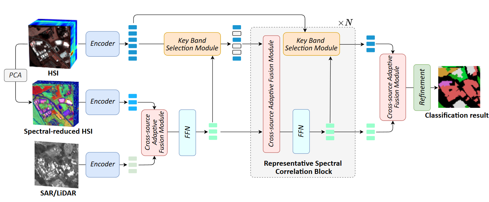

# RSCNet 🌍

PyTorch implementation of **RSCNet: Representative Spectral Correlation Network for Multi-source Remote Sensing Image Classification**.

This project corresponds to the paper **"Representative Spectral Correlation Network for Multi-source Remote Sensing Image Classification"**, published in **IEEE Transactions on Geoscience and Remote Sensing (IEEE TGRS), 2026**.

<p align="center">
  <a href="https://ieeexplore.ieee.org/document/11483234">
    
  </a>
  <a href="https://drive.google.com/drive/folders/1P9pr-6vbdnS4PPdo1fhg5jP9oZC4ct-v?usp=sharing">
    
  </a>
  <a href="https://drive.google.com/drive/folders/1zBdoeyQBTmNeXMcnsazmFDxOyot9nUQ1?usp=sharing">
    
  </a>
</p>


## 🔎 Overview

RSCNet is proposed for **multi-source remote sensing image classification**, especially for joint interpretation of **HSI with SAR/LiDAR**. Although HSI provides rich spectral signatures, its hundreds of contiguous bands also introduce strong spectral redundancy. At the same time, HSI and SAR/LiDAR are generated by very different imaging mechanisms, which makes direct feature fusion difficult due to the large cross-source semantic gap.

To address these two challenges, the paper introduces **Representative Spectral Correlation Network (RSCNet)**, which tightly couples **spectral band selection** with **cross-source feature interaction**. Instead of treating spectral reduction as an isolated preprocessing step such as PCA, RSCNet allows representative spectral bands to be **dynamically selected under multi-source guidance**, so that discriminative class-related spectral information can be preserved during fusion.

The framework is built around two key components:

- 🧠 **Key Band Selection Module (KBSM):** adaptively evaluates the importance of original HSI bands using cross-source fused features as guidance, suppressing redundant bands while preserving representative and task-relevant spectral responses.
- 🔗 **Cross-source Adaptive Fusion Module (CAFM):** enhances heterogeneous feature interaction through adaptive cross-source weighting together with local-global contextual refinement, producing more discriminative fused representations for classification.

By progressively alternating representative band selection and cross-source fusion, RSCNet learns compact yet expressive multi-source features and achieves strong classification performance with relatively low computational complexity.


## 📊 Supported Datasets

The code currently supports the following dataset settings:

| `datasetType` | Dataset     | Modalities  | Classes |
| ------------- | ----------- | ----------- | ------- |
| `0`           | Houston2013 | HSI + LiDAR | 15      |
| `1`           | Houston2018 | HSI + LiDAR | 20      |
| `2`           | Trento      | HSI + LiDAR | 6       |
| `3`           | Berlin      | HSI + SAR   | 8       |
| `4`           | Augsburg    | HSI + SAR   | 7       |


## 📁 Repository Structure

```text
RSCNet/
├── code/
│   ├── task.py
│   ├── train.py
│   ├── test.py
│   ├── dataset.py
│   ├── net_RSCNet.py
│   ├── report.py
│   ├── visualization.py
│   └── parameter.py
├── model/
├── log/
├── report/
└── pic/
```


## 📦 Data Preparation

The datasets can be downloaded from:

- 📥 Dataset archive: https://drive.google.com/drive/folders/1P9pr-6vbdnS4PPdo1fhg5jP9oZC4ct-v?usp=sharing

The current code expects the data directory to be placed **alongside** the repository, for example:

```text
workspace/
├── RSCNet/
└── data/
    ├── Houston2013/
    ├── Houston2018/
    ├── Trento/
    ├── Berlin/
    └── Augsburg/

```

Please keep the original `.mat` filenames used by the provided dataset package, since the paths are hard-coded in [`code/dataset.py`](code/dataset.py).

## 🧩 Pretrained Weights

Pretrained model weights can be downloaded from:

- 📥 Weights archive: https://drive.google.com/drive/folders/1zBdoeyQBTmNeXMcnsazmFDxOyot9nUQ1?usp=sharing

Place the downloaded weights under the `model/` directory, or update the paths in [`code/parameter.py`](code/parameter.py) if you want to use a different location.

## 🚀 Training and Testing

The main entry script is [`code/task.py`](code/task.py).

1. Move into the code directory:

```bash
cd code
```

2. Edit the configuration if needed:

- 🗂️ Set the dataset by changing `datasetType` in `task.py`
- 💻 Set the device by changing `dev`, for example `cuda:0`
- ⚙️ Adjust training hyperparameters in `parameter.py` or in `myTask(...)`

3. Run training and testing:

```bash
python task.py
```

Current default call in `task.py`:

```python
myTask(0.0001, 1, 3, dev)
```

This means:

- learning rate = `1e-4`
- epochs = `1`
- dataset = `Berlin` (`datasetType = 3`)

For a full experiment, please update the epoch number and dataset setting before running.

## 📝 Outputs

By default, the project saves:

- 💾 trained models to `model/`
- 📜 training logs to `log/`
- 📈 evaluation reports to `report/`
- 🖼️ visualization maps to `pic/` when visualization is enabled


## 💡 Notes

- The dataset paths in the current implementation are defined with relative paths in `code/dataset.py`.
- The parameter file contains several demo/default output filenames.
- If you only want evaluation with pretrained weights, you can call `myTest(...)` in [`code/test.py`](code/test.py) after setting the correct dataset index and model path.

## 📚 Citation

If you find this repository useful, please cite:

```bibtex
@ARTICLE{11483234,
  author={Gong, Chuanzheng and Gao, Feng and Lin, Junyan and Dong, Junyu and Du, Qian},
  journal={IEEE Transactions on Geoscience and Remote Sensing}, 
  title={Representative Spectral Correlation Network for Multi-source Remote Sensing Image Classification}, 
  year={2026},
  volume={},
  number={},
  pages={1-1},
  keywords={Sentinel-1;Earth Observing System;Apertures;Feeds;Antennas;Filtering;Filters;Semiconductor lasers;Semiconductor optical amplifiers;Circuits and systems;Multi-source data fusion;Spectral band;Sparse attention;Hyperspectral image;Synthetic aperture radar},
  doi={10.1109/TGRS.2026.3684877}}

```

## 📬 Contact

If you have any questions, feel free to contact us via email:

- 📧 Feng Gao: gaofeng@ouc.edu.cn
- 📧 Chuanzheng Gong: gongchuanzheng@stu.ouc.edu.com

We hope **RSCNet** helps your research ⭐ If you find our work useful, please consider citing the paper and starring this repository.
